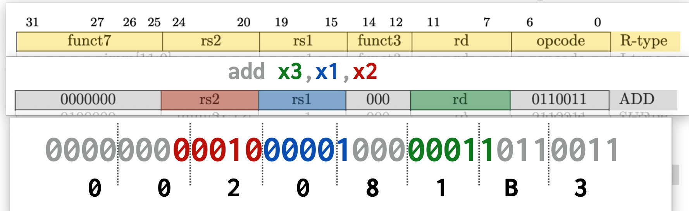

# CS107E 第一周
## 装东西
给的指导教程里面，macos arm版的支持度比其他要好一点，主要体现在一开始没有intel版的编译工具（现在有了），wsl版的编译工具编译`sample_build`代码不成功（现在可以了），wsl版没有`riscv64-unknown-elf-gdb`（文档更新暂时不需要gdb了）。毕竟这个课第一次用riscv教学。

~~基于个人习惯，用虚拟机装ubuntu搞实验环境~~
- ~~虚拟机安装 Ubuntu 22.04 server~~
- ~~[安装编译环境](https://cs107e.github.io/guides/install/devtools-wsl/)~~
  - ~~只看 `Install riscv-unknown-elf toolchain`部分~~
- ~~[安装xfel](https://xboot.org/xfel/#/)~~
  - ~~编译安装xfel到Ubuntu中~~

> 发现教程里面的riscv安装包用的是Debian 12.2 的，那我直接虚拟机安装 Debian 就好了嘛

### 搭建 Debian 12.2 虚拟机实验环境
1. 下载[镜像](https://cdimage.debian.org/debian-cd/current/amd64/iso-cd/debian-12.4.0-amd64-netinst.iso)
2. 安装Debian，安装 `SSH server` 和 `standard system utilties`，不安装桌面
3. 进入系统安装必要包
    ```bash
    apt install sudo vim git
    ```
4. 安装虚拟机工具，顺便安装了gcc, make, linux-header等东西
5. 用户加入到sudo组里面
    ```bash
    usermod -a -G sudo jiyi
    ```
6. 安装交叉编译工具
    ```bash
    sudo apt install gcc-riscv64-unknown-elf
    ```
7. [安装xfel](https://xboot.org/xfel/#/)
    ```bash
    git clone https://github.com/xboot/xfel.git
    cd xfel
    sudo apt install libusb-1.0-0-dev pkg-config
    make
    sudo make install
    # 使用以下命令就能检测到插上OTG口芒果派
    xfel version
    ```
8. cs107e环境
    ```bash
    mkdir ~/cs107e_home
    cd ~/cs107e_home
    git clone https://github.com/cs107e/cs107e.github.io.git
    vim ~/.bashrc
    # 添加以下两行
    export CS107E=~/cs107e_home/cs107e.github.io/cs107e
    export PATH=$PATH:$CS107E/bin

    source ~/.bashrc
    cd $CS107E/sample_build
    make
    # 没报错就是第6步安装正常

    cd $CS107E/bin
    mango-run blink-actled.bin
    # 芒果派led开始闪，说明第7步安装正常
    ```

## 学东西
第一周是汇编和riscv，官方讲义过于简略了。去B站看[循序渐进，学习开发一个RISC-V上的操作系统 - 汪辰 - 2021春](https://www.bilibili.com/video/BV1Q5411w7z5)

### RISC 的5级流水线
为了看懂[ripes.me](https://ripes.me/)的Stage。来源 https://www.sunnychen.top/archives/rvintropipeline https://en.wikipedia.org/wiki/Classic_RISC_pipeline
- IF = Instruction Fetch
  - 从指令存储器中获取指令
- ID = Instruction Decode
  - 译码并读取寄存器
- EX = Execute
  - 执行指令
- MEM = Memory access
  - 从数据存储器中读取数据
- WB = Register write back
  - 将结果写回寄存器

### 1GB的内存大小是0x40000000
一位16进制代表4位二进制，0x40000000 是1后面跟`4*7+2=30`个0的二进制数，即2<sup>30</sup>个地址。

1个地址代表1byte=1B=8bit的数据。

2<sup>10</sup> 是 0x00000400 是 1KB\
2<sup>20</sup> 是 0x00100000 是 1MB 是 1K个1KB\
2<sup>30</sup> 是 0x40000000 是 1GB 是 1K个1MB

严格来说以上地址都应该**减1**，即1GB的内存大小是0x40000000-1

### 指令存储
`add x3, x1, x2`
将寄存器 x1 + x2 结果放入 x3 中



以上指令长32bit，为`0x0020 81B3`

每个内存地址存储8bit，小端存储，则以上指令在内存中的顺序是 B3, 81, 20, 00

### 点亮LED

- led内里大头是负极
- MMIO(Memory mapping I/O)就是**通过将外围设备映射到内存空间，便于CPU的访问**
- GPIO地址从`0x0200 0000`开始
- 内存(DRAM)地址从`0x4000 0000` 开始，`0xBFFF FFFF` 结束，共2G可用地址
- 用了两个寄存器 `PB_CFG0` 和 `PB_CFG1` 共52bit，设置13个PB接口 PB0 到 PB12
- 每个GPIO，fn0(0000)是输入，fn1(0001)是输出，fn9-13保留，其他位看文档
- 用了一个寄存器 `PB_DAT` 共 13bit，用于13个PB口的读写或拉高降低
- 当CFG设置为输出(1)，DAT设1是高电平，0是低电平
- MangoPi 默认启用`FEL`模式(Firmware Exchange Loader)（固件更换器？），用xfel 进行控制
- `lui` 高位立即数装载指令，把立即数左移12位，存入寄存器中
  - 0x2000 << 12 == `0x0200 0000` （左移 3个4bit，16进制加3个0）
- `sw` 字存储指令，把寄存器加上偏移量的地址，用目标寄存器中的值进行设置
- 有伪指令 `li rd, immediate` 立即数加载指令可替代 `addi a1, zero, 1`
  - hexdump后为`93 05 10 00`，即指令`0x00100593`
  - 二进制为 `0b0000 0000 0001 0000 0000 0101 1001 0011`
  - 以指令分割 `000000000001 00000 000 01011 0010011`
  - 得到汇编指令 `addi x11,x0,1`
  - 即 `addi a1, zero, 1`
  - 结论：立即数不大的时候`li`使用的就是`addi`指令
- 命令行`riscv64-unknown-elf-as on.s -o on.o`
  - 将指定汇编文件 `on.s` 编译成指定名称 `on.o`
  - `-o` 指定输出的文件名
- 命令行 `riscv64-unknown-elf-objcopy on.o -O binary on.bin`
  - `-O binary` 输出为原始的二进制文件
  - 使用xfel运行程序，原始二进制就够了