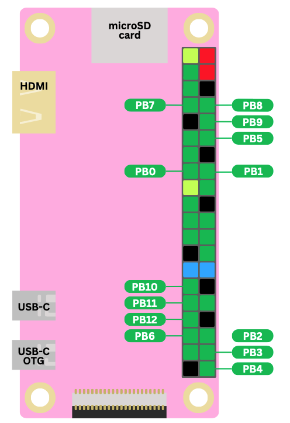
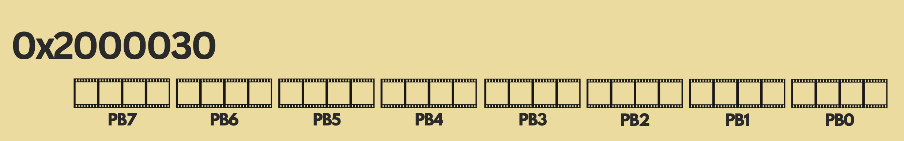
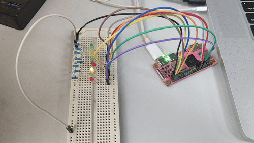

# CS107E Assignment 1

## 准备

### 选择GPIO接口

- `PB0-12`
- `PC0-1`
- `PD14、15、17、21、22`
- `PE16-17`
- 所以要用PB连8个LED
- 
- 以上来自 https://cs107e.github.io/guides/MeetYourGPIOPins.pdf

### 写个`Makefile`

抄 https://github.com/cs107e/cs107e.github.io/tree/master/cs107e/sample_build

```makefile
PROGRAM = larson.bin

all: $(PROGRAM)

%.bin: %.o
	riscv64-unknown-elf-objcopy $< -O binary $@

%.o: %.s
	riscv64-unknown-elf-as $< -o $@

run: $(PROGRAM)
	mango-run $<

clean:
	rm -f *.o *.bin *.elf *.list *~

.PHONY: all clean run
.PRECIOUS: %.o
```

- 编译程序用 `make`，生成 `.o` 和 `.bin` 文件
- 运行程序用 `make run`，把 `.bin` 文件写入芒果派内存并启动
- 删除编译后的二进制文件用 `make clean`

## 操作

### 编写 `larson.s`

https://cs107e.github.io/guides/ProgramYourGPIOPins.pdf

- PB0 至 PB7 设置 output
  - 
  - `0001 0001 0001 0001 0001 0001 0001 0001`
  - `0x11111111`
- 使用左移指令 `SLLI`

### 面包板

我手上的面包板分三个区域
- 1-15
- 16-45
- 46-60

跨区接地要重搭一根线

### 结果

