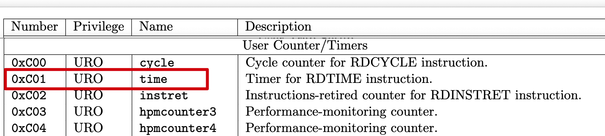

# cs107e 里的家庭作业2

## 从哪里开始呢…

先看一遍 https://cs107e.github.io/assignments/assign2/

## 我需要做什么？

先实现 `gpio.c`, `timer.c`, `timer_asm.s` 这些通用模块，然后实现 `clock.c` 这个作业程序。

- `gpio.c` 的接口文件是 `$CS107E/include/gpio.h`
- `timer.c` 的接口文件是 `$CS107E/include/timer.h`

## 抄准备文件

文件来自 `$CS107E`

### memmap 直接抄 lib/memmap.ld

```memmap
STACK_SIZE = 0x100000; /* 1 MB */

SECTIONS
{
    .text  0x40000000     :  { *(.text.start) *(.text*) }
    .rodata               :  { *(.rodata*) *(.srodata*) }
    __text_end            = .;
    .data  ALIGN(0x20000) :  { *(.sdata*) }
    __bss_start           = .;
    .bss                  :  { *(.bss*)  *(.sbss*) *(COMMON) }
    __bss_end             = .;
    .heap  0x44000000     :  { __heap_start = .; }
    .stack 0x50000000 - STACK_SIZE : {
        __heap_max = .;
        . = . + STACK_SIZE;
        __stack_top = .;
    }
}

/* Force link of _start and verify correct position */
ENTRY(_start_gdb)
ASSERT(_start == ADDR(.text), "_start symbol must be placed first in text section")
```

### start.s 抄 src/start.s

删除中断相关的代码

```s
.attribute arch, "rv64im_zicsr"

# Identify this section as the one to go first in binary image
.section ".text.start"

.globl _start
_start:
.cfi_startproc
.cfi_undefined ra           # tell gdb this is start routine

    csrc    mstatus, 1<<3   # global disable interrupts, mstatus.mie = 0
    # la      t0,_trap_handler #  _trap_handler 关键字来自 interrupts.c 用不到，注释掉
    # csrw    mtvec,t0        # install trap handler
.globl _start_gdb
_start_gdb:                 # entry for gdb will skip csr as not avail in sim
    addi    fp,zero,0       # init fp
    la      sp,__stack_top  # init sp (stack grows down)
    jal     _cstart

hang: j hang
    ret
.cfi_endproc
```

### cstart.c 抄 src/cstart.c

删除 string.h 和 mango.h 相关的内容

```c
extern void main(void);
void _cstart(void);

void _cstart(void) {
    main();
}
```

### Makefile

```makefile
NAME = clock

ARCH = -march=rv64im_zicsr -mabi=lp64
ASFLAGS = $(ARCH)
CFLAGS = $(ARCH) -g -Og -I$$CS107E/include -Wall -ffreestanding
LDFLAGS = -nostdlib -T memmap

all : $(NAME).bin

%.bin: %.elf
	riscv64-unknown-elf-objcopy $< -O binary $@

%.elf: %.o start.o cstart.o gpio.o timer.o timer_asm.o
	riscv64-unknown-elf-gcc $(LDFLAGS) $^ -o $@

%.o: %.c
	riscv64-unknown-elf-gcc $(CFLAGS) -c $< -o $@

%.o: %.s
	riscv64-unknown-elf-as $(ASFLAGS) $< -o $@

clean:
	rm -f *.o *.bin *.elf *.list *~

run: $(NAME).bin
	mango-run $<

test: test_gpio_timer.bin
	mango-run $<

.PHONY: all clean run test
.PRECIOUS: %.elf %.o
```

## gpio.c 的实现

1. `gpio_init`
    ```c
    void gpio_init(void) {
      return;
    }
    ```
2. `gpio_id_is_valid`
    ```c
    bool gpio_id_is_valid(gpio_id_t pin) {
        return (pin >= GPIO_PB0 && pin <= GPIO_PB0 + GPIO_PB_LAST_INDEX) ||
              (pin >= GPIO_PC0 && pin <= GPIO_PC0 + GPIO_PC_LAST_INDEX) ||
              (pin >= GPIO_PD0 && pin <= GPIO_PD0 + GPIO_PD_LAST_INDEX) ||
              (pin >= GPIO_PE0 && pin <= GPIO_PE0 + GPIO_PE_LAST_INDEX) ||
              (pin >= GPIO_PF0 && pin <= GPIO_PF0 + GPIO_PF_LAST_INDEX) ||
              (pin >= GPIO_PG0 && pin <= GPIO_PG0 + GPIO_PG_LAST_INDEX);
    }
    ```
3. `gpio_set_input`
    ```c
    void gpio_set_input(gpio_id_t pin) {
        gpio_set_function(pin, GPIO_FN_INPUT);
    }
    ```
4. `gpio_set_output`
    ```c
    void gpio_set_output(gpio_id_t pin) {
        gpio_set_function(pin, GPIO_FN_OUTPUT);
    }
    ```
5. `gpio_function_is_valid`
    ```c
    bool gpio_function_is_valid(unsigned int function) {
        return function >= GPIO_FN_INPUT && function <= GPIO_FN_DISABLED;
    }
    ```
1. `gpio_set_function`
    - `void gpio_set_function(gpio_id_t pin, unsigned int function);`
    - 验证 `pin` 和 `function` 在两个枚举值内
    - 通过 `pin` 值获取实际地址，和对应地址寄存里的位置
      - `pin`值是`0xNnn`格式的数字，由`N`值确定是哪个组，由`nn`确定是组内第几个
      - `pin >> 8 == 0xN`
      - `pin & 0xff == 0xnn`
      - `0xN * (每个组占用的固定偏移量) + (GPIO 基准地址) == (组开始地址)`
      - 每个CFG最多有3个32位寄存器，每个pin有其中4位决定设置值
    - 将以上寄存里对应位置的值设置为 `function` 值
2. `gpio_get_function`
    - `unsigned int gpio_get_function(gpio_id_t pin);`
    - 验证 `pin`，验证不通过返回 `GPIO_INVALID_REQUEST`
    - 和上步相同方式获取`pin`的实际地址与寄存器中的位置
    - 获取寄存器中对应位置的值
4. `gpio_write`
    - `void gpio_write(gpio_id_t pin, int val);`
    - 验证`pin`和`val`，`val`值只能是0或1
    - 通过`pin`值获取`pin_dat`实际地址和对应寄存器里的位置
    - 寄存器里的位置设置`val`
5. `gpio_read`
    - `int gpio_read(gpio_id_t pin);`
    - 验证`pin`
    - 获取对应寄存器地址和位置
    - 获取值

## timer_asm.s 和 timer.c 的实现

### 用汇编语言写个函数？

- 函数名作为标签
- a0, a1, 等作为参数
- a0，作为返回值

比如：

```c
int sum(int a, int b) {
    return a + b;
}
```

等同为

```s
sum:
    add     a0,a0,a1
    ret
```

### 怎么写？



看文档这意思只需要

```s
.section .text
.globl timer_get_ticks

timer_get_ticks:
    csrr a0, time
    ret
```

### .section 是做什么用的？

- 用于定义代码所属的段
  - 文本段（.text）用于存放程序的代码
  - 数据段（.data）用于存放程序的数据
  - bss段（.bss）用于存放未初始化的全局变量

### .globl 是做什么用的？

- 声明全局符号
- 可以被其他文件或模块访问
- 在这里是实现了`timer.h`里面的`timer_get_ticks`函数

### 24MHz 要多长时间才能把 unsigned long 类型的寄存器填满？

- 是 64 bit 的寄存器
- 2^64 / 24 / 1000 / 1000 / 3600 / 24 / 356 = 24988.761977364382 年

### c 文件呢

```c
void one_us() {
  unsigned long star_ticks = timer_get_ticks();
  while(1) {
    unsigned long curr_ticks = timer_get_ticks();
    if ((curr_ticks - star_ticks) >= TICKS_PER_USEC) {
      break;
    }
  }
}

void timer_delay_us(int usec) {
  for(int i = 0; i < usec; i++) {
    one_us();
  }
}

void timer_delay_ms(int msec) {
  timer_delay_us(1000 * msec);
}

void timer_delay(int sec) {
  timer_delay_ms(1000 * sec);
}
```

### 运行起来怎么样？

不行……时间误差20%

### 为什么这么大误差？

函数多次调用引起的延时？

### 更改延时函数

```c
void one_us(int mul) {
  unsigned long star_ticks = timer_get_ticks();
  while(1) {
    unsigned long curr_ticks = timer_get_ticks();
    if ((curr_ticks - star_ticks) >= TICKS_PER_USEC * mul) {
      break;
    }
  }
}

void timer_delay_us(int usec) {
  one_us(usec);
}
```

可以用了

## 测试显示

```c
// 位对应的GPIO接口 D4, D3, D2, D1
gpio_id_t digit[4] = { GPIO_PC0, GPIO_PB2, GPIO_PB3, GPIO_PB4 };

// 块对应的GPIO接口，A, B, C, D, E, F, G, DP
gpio_id_t segment[8] = { GPIO_PD17, GPIO_PB6, GPIO_PB12, GPIO_PB11, GPIO_PB10, GPIO_PE17, GPIO_PB0, GPIO_PD22};

// 将一个数组里的gpio接口设置对应输出方式
void list_gpio_set_function(gpio_id_t * list, int length, unsigned int function) {
    for(int i = 0; i < length; i++) {
        gpio_set_function(list[i], function);
    }
}

// 写入gpio列表的到对应dat寄存器
void list_gpio_write(gpio_id_t * list, int length, int data) {
    for(int i = 0; i < length; i++) {
        gpio_write(list[i], (data >> i) & 0x1 );
    }
}

// 初始化，把数字位和数字块设置成输出
void clock_init(void) {
    list_gpio_set_function(digit, 4, GPIO_FN_OUTPUT);
    list_gpio_set_function(segment, 8, GPIO_FN_OUTPUT);
}

// 测试数字位
void test_breadboard(void) {
    gpio_init();
    timer_init();
    clock_init();

    int digit_postion = 0b1;
    int segment_postion = 0b1;

    while(1) {
        while (digit_postion < 9) {
            list_gpio_write(digit, 4, digit_postion);
            while(segment_postion < 129) {
                list_gpio_write(segment, 8, segment_postion);
                segment_postion = segment_postion << 1;
                delay();
            }
            segment_postion = 0b1;
            digit_postion = digit_postion << 1;
        }
        digit_postion = 0b1;
    }
}
```


## 基本功能


