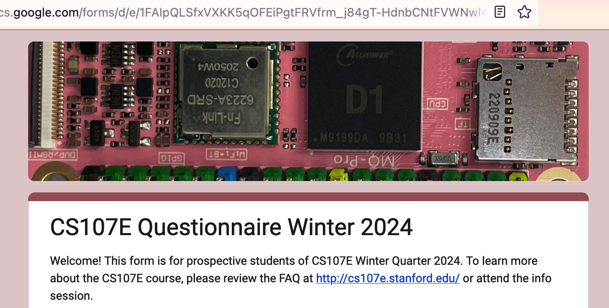
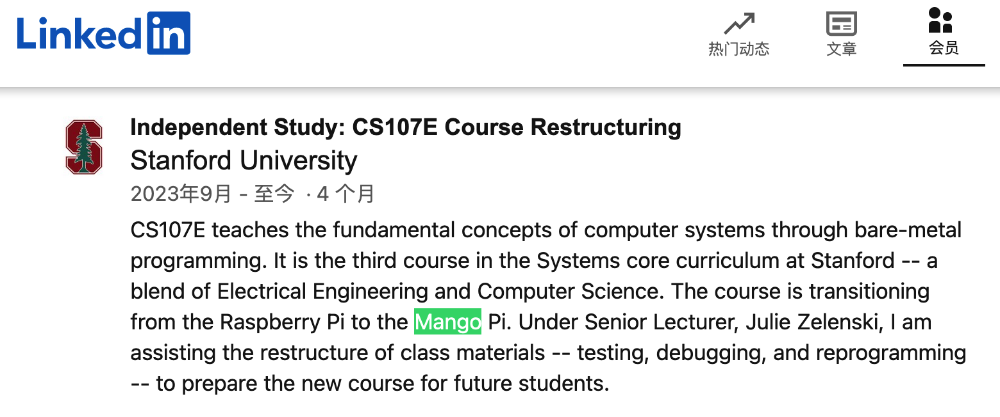

# CS107E 换 RISC-V 了

又到了一年几度想学公开课的日子，又打开了CS107E的页面，哦~winter 2024要开始了，哦~ RISC-V。

## 想学

risc-v，开源的，前两天美国想限制但没成的那个？有前景…~~功利的小算盘在心中打响~~

## 用的啥开发板？

没有，官网上什么信息页没有留，只有一句 `CS107E runs bare-metal (no OS or libraries) on a Risc-V SBC.` ，哪家的板啥型号cpu什么也没说。github上搜不到，twitter上搜不到，松鼠症犯了啊，想买板子啊。

## 找到了

今天首页更新了信息，新生填调查问卷。点进去抱着期望填了一遍（没提交），板子信息还是没有透露。正准备关闭了，等等，这个头图

allwinner，d1，是 risc-v 呀。

用这个芯片的的粉色板子，是 Mango Pi 呀。

买买买…等等，万一是整调查文件的人随便找了个好看的risc-v头图怎么办，那不就白买了。拿cs107e 和 mangopi 做关键字搜索，还真有从 Linkedin 上漏出来的消息

行，可以安心上咸鱼收芒果派了，神经病得到了缓解。

## 后续还是要学的

跟着学吧，专门开了个页面，后续更新放里面。

虽然开始过好多遍了。