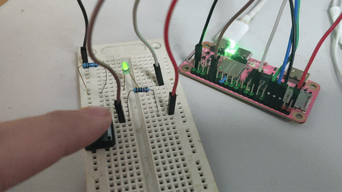
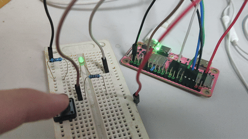

# CS107E lab1 里的 "Add a button"

- `lw` load word, 一个 word 长 32bit
- `PC_DAT` 偏移地址 `0x0070`，长32位，用了前13位
- `beq a2, zero, off` 如果 a2 等于 0，即 PC0 读到电平是GND，则跳转到 off
- 
- 不做按钮的上拉电路，也能正常用
  - 
  - INPUT 默认读取的是高电平？