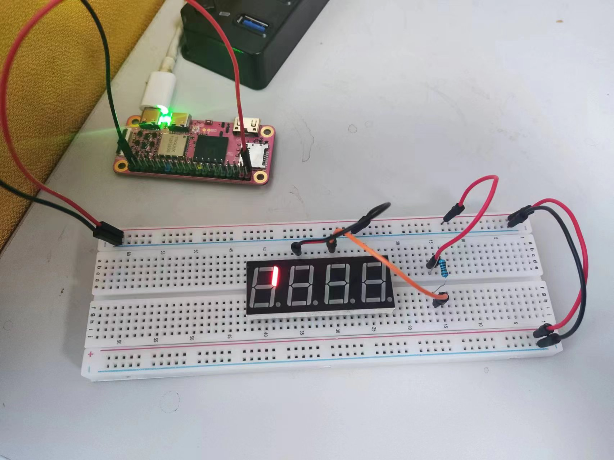
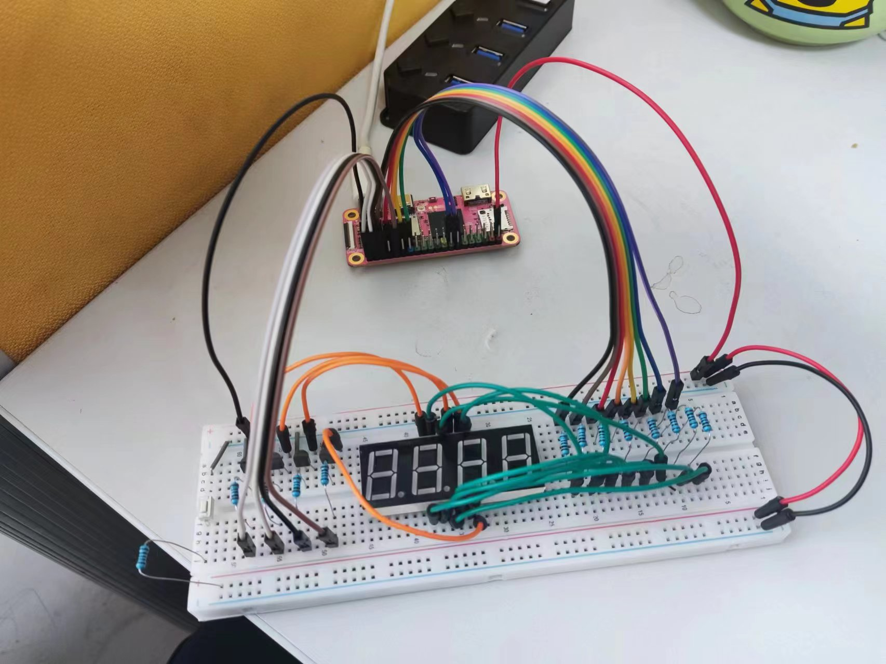
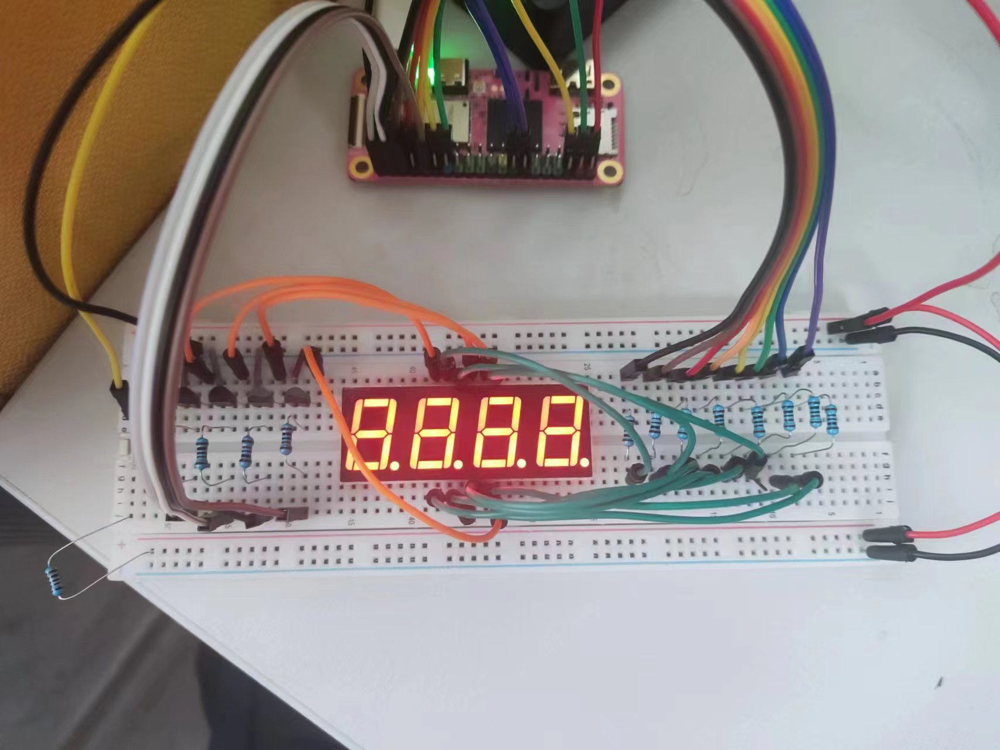

# CS107E Lab2

## 实验1，查看把`C`编译成汇编的样子

~~没有 `codegen.c` , 搞不了~~

搞到了旧版 https://gcc.godbolt.org/z/7YYczMjes

### %hi(global) 是什么？

- risc-v 汇编语言操作符
  - https://sourceware.org/binutils/docs/as/RISC_002dV_002dModifiers.html
- 获取全局符号的地址的高20位部分。
  - 和 lui 的功能相对应
- 获取 global 这个符号的地址高位部分

### %lo(global) 和 hi 差不多？

- 是的
- 获取全局符号的地址的低12位部分
- 即获相对于 %hi(global) 这个地址的偏移量
- 合在一起 `%lo(global)(a3)` 就是指向 global 的地址

### 为什么要这么写？

- 教材使用的是 32bit 的 RISC-V，地址长度为 32bit
- global 地址下存储的是4个字节的0，即一个 int 类型，大小是一个 word
- 从一个内存地址中读一个 word 使用指令 `LW rd， imm12(rs1)`
- 需要将以上 `im12(rs1)` 和 `global` 对应起来

### 所以就是套路？

- 是的
- 都这么读全局变量

### num = -num；怎么没了

- 在下面
- `neg a5, a5` 即 `sub a5, zero, a5`
- 顺序变了不影响结果
- 只能认为，编译器觉得这样比较好

### num = 5 * num; 怎么变了

- num 逻辑左移 2 位，即 num * 2^2
- 再相加 `num * 4 + num` = `num * 5`
- 结果是一样的
- 只能认为，编译器觉得这样比较好

### 下一条好长

- 一步一步来
- -1 << 4 即 0xffffffff << 4 即 0xfffffff0
- 取反得 0x0000000f 即 15
- num 是 0 ， `num & 15` 等价于 `num + 15`
- `(12*18 - 1)/2` = 107.5，因为int类型，编译器省略的小数点，得 107
- 最后用了乘法指令 mul

### 那个 & 等价 + 过于奇怪了

- 只能认为，编译器就是这么神奇

### 修改成 `int num = 3;` 怎么样

- 编译器直接把值算出来了
- (-15 & 15) * (107 - 15) = (0xfffffff1 & 0x0000000f) * 92 = 92

### partb 里面，if else 在不同优化条件下汇编指令不一样

- `-Og` 更符合直觉
- `-O2` 跳转更少，可以理解为性能更好

### partc里面，-O2 就啥都没了？

- 啊，不理解，往下看吧

### partd 指针，脑袋要爆炸

- 一步一步来
- `int n = global;`
  - a4 存 global 高位地址
  - a5 存 global 值 g1
- `*prt = val`
  - global 地址里值更改为 g2 = 107
  - a2 存 107
- `*(char *)ptr = val`
  - 107 在 char 范围 -128 ~ 127 之间，忽略
- `ptr[10] = val`
  - 因为 prt 是 int * 类型，所以地址偏移量是 10 * 4
  - a3 存 global 完整地址
- `cptr[10] = val`
  - 因为 cptr 是 char * 类型，所以偏移量 10 * 1
  - sb , Store byte
  - cptr 存储的指针指向地址0，所以使用 10(zero)
- `n = *(ptr + n);`
  - a5 存 n 的值
  - ptr 偏移 n，需要`地址 + 4 * n`，即 `a3 + a5 << 2`
  - a5 存从内存拿到的 n 的值
- `n = ptr[n]`
  - 和上一句汇编内容相同

### main

- 对 sp 和 ra 的操作是用来调函数用的
- O2 里面把 part a 和 b 直接放到 main 里面了
- O2 用到了 `tail` 尾调用

### 到最后都没看到 partc

- -Og 里面也没有调用 partc
- 被优化掉了
- 这种延时写法不符合规范

### 🤯

- 休息一会儿

## 实验2，makefile

当自己会了，不搞

## 实验3，测试用例

- ~~头文件里有`assert.h`，但需要串口。暂时不能用~~
- ~~没有 `testing` 文件夹搞不了~~


芒果派ACT LED 连接的是 LCD_PWM，对应GPIO_PD18，见 https://mangopi.org/_media/mq-pro-sch-v12.pdf

### 写个 gpio_set_output

- GPIO offset 从 0x0030 开始，
- PB 偏移量是 0x0030，PB到PC到PD 每次 多 0x30
- CFG0 从 0x00 开始，DAT 是 CFG0 + 0x10
- 课程代码 gpio_id 是 0xNnn 格式的
  - 选择组是 `0x0030 + N * 0x30`
  - 选择CFG 的地址偏移量是 `(nn / 8) * 4 + 上面地址`
  - 设置CFG 的值`0x1 << ((nn % 8) * 4)`
  - 例如 `GPIO_PD18 = 0x212`
    - 组地址偏移量是 `0x0030 + (GPIO_PD18 >> 8) * 0x30 = 0x90`  是**PD**
    - CFG地址偏移量是 `(0xff & GPIO_PD18) / 8 * 4 + 0x90 = 0x98` 是 **PD_CFG2**
    - CFG 寄存器设置的值是 `0x1 << (((0xff & GPIO_PD18) % 8) * 4)= 0x100` 是 **PD18** 设置为 **output**

```c
void gpio_set_output(gpio_id_t pin) {
    unsigned int base_address = 0x30 + (pin >> 8) * 0x30 + GPIO;
    volatile unsigned int *CFG = (unsigned int *) ( ( 0xff & pin ) / 8 * 4 + base_address );
    unsigned int offset = ((0xff & pin) % 8) * 4;
    *CFG = (*CFG & ~(0xf << offset)) | (1 << offset);
}
```

## 实验4，显示数字的电路

### 先连一路看数字LED是否正正常



### 连上电路手动做测试


### 连上Pi



### Pi编程测试

#### 按灯的顺序

| 灯 | GPIO |
| -  | -   |
| D1 | PB4 |
| D2 | PB3 |
| D3 | PB2 |
| D4 | PC0 |
| A | PD17 |
| B | PB6 |
| C | PB12 |
| D | PB11 |
| E | PB10 |
| F | PE17 |
| G | PB0 |
| DP | PD22 |

#### 按GPIO的顺序

| GPIO | 灯 |
| - | - |
| PB0 | G |
| PB2 | D3|
| PB3 | D2|
| PB4 | D1|
| PB6 | B |
| PB10 | E |
| PB11 | D |
| PB12 | C |
| PC0 | D4|
| PD17 | A |
| PD22 | DP|
| PE17 | F |

#### 将以上管脚都设置为输出高电平

```bash
# PB_CFG0 0000 0001 0000 0001 0001 0001 0000 0001
xfel write32 0x02000030 0x1011101
# PB_CFG1 0000 0000 0000 0001 0001 0001 0000 0000
xfel write32 0x02000034 0x11100
# PB_DAT  0000 0000 0000 0000 0001 1100 0101 1101
xfel write32 0x02000040 0x1c5d
# PC_CFG0 0000 0000 0000 0000 0000 0000 0000 0001
xfel write32 0x02000060 0x1
# PC_DAT  0000 0000 0000 0000 0000 0000 0000 0001
xfel write32 0x02000070 0x1
# PD_CFG2 0000 0001 0000 0000 0000 0000 0001 0000
xfel write32 0x02000098 0x1000010
# PD_DAT  0000 0000 0100 0010 0000 0000 0000 0000
xfel write32 0x020000a0 0x420000
# PE_CFG2 0000 0000 0000 0000 0000 0000 0001 0000
xfel write32 0x020000c8 0x10
# PE_DAT  0000 0000 0000 0010 0000 0000 0000 0000
xfel write32 0x020000d0 0x20000
```

没问题的话就是全亮

