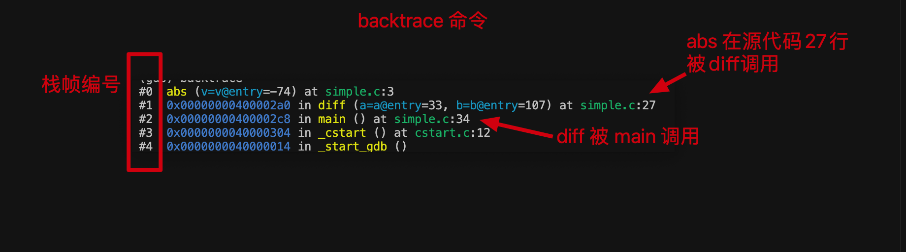
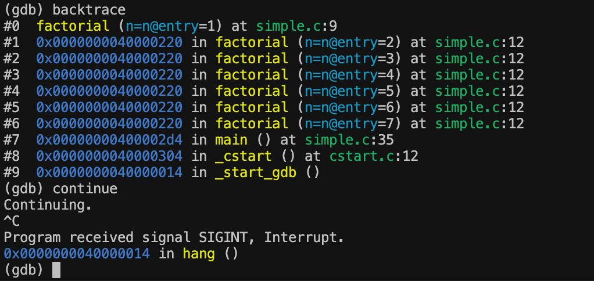

# CS107E lab3 调试和测试

## 没有`riscv-unknown-elf-gdb`

~~用 `gdb-multiarch`~~
lab3 里有安装教程

## simple 项目

- 复制 assign2 里面的 `cstart.c`, `Makefile`, `memmap`, `start.s`
- 旧版 `simple.c` 代码
  - https://gcc.godbolt.org/z/s3aT4x5dx
- 调试命令
  - `riscv64-unknown-elf-gdb -q --command=$CS107E/other/gdbsim.commands simple.elf`

## gdb

- 当 gdb 显示程序停在某一行时，它停在该行执行之前
- `next` 执行当前所在函数的整个下一行代码，一直都在本函数中
- `step` 执行下一行代码，这一行可能跳转到另一个函数中
- `回车` 重复上一条指令
- `list` 查看程序上下文
- `continue` 继续执行程序
- `ctrl-c` 中断程序让gdb接管
- `backtrace` 查看程序在被中断时的执行位置
- 工作流程：
  1. 在要调试的函数上设置断点。运行程序直到触发断点。
  2. 使用 next 逐行步进函数的代码，检查变量以确定问题出现的位置。
  3. 如果下一行代码是调用一个子程序，并且怀疑问题可能出现在该调用内部，使用 step 进入其中。如果通过调用使用 next，然后意识到希望使用 step，可以使用 run 从头开始重新运行程序。
  4. 重复 2-3，直到找到 bug。
- `delete` 删除所有断点
- `break 函数名` 设置断点
- `run` 重新运行程序，直到遇到断点
- `disassemble` 列出当前程序上下文的汇编指令
- 
- `info frame` 查看当前栈帧信息
- `info local` 查看当前栈帧局部变量
- `info args` 查看当前栈帧参数
- `up` 和 `down` 调整当前所在栈帧
- `info reg` 当前设备寄存器
- `print $a1` 显示寄存器 a1 的值
- 

##