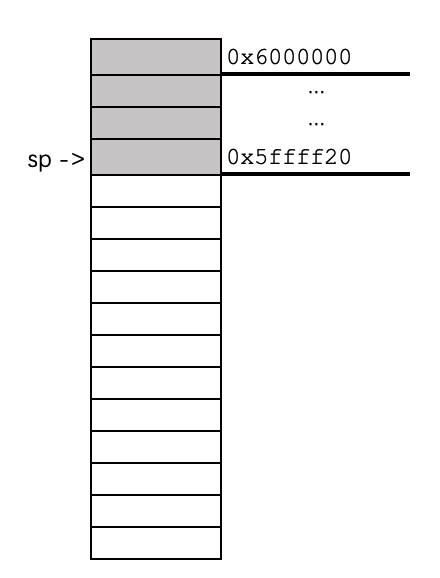
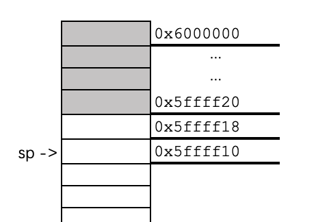
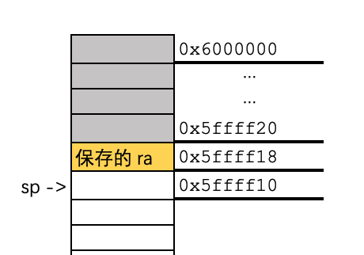
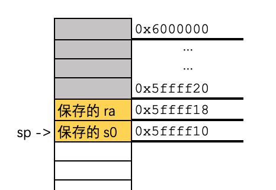
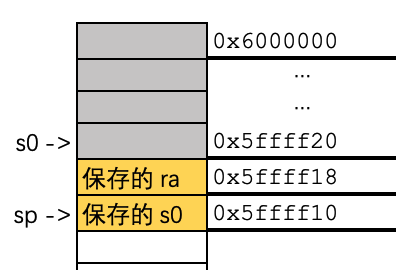
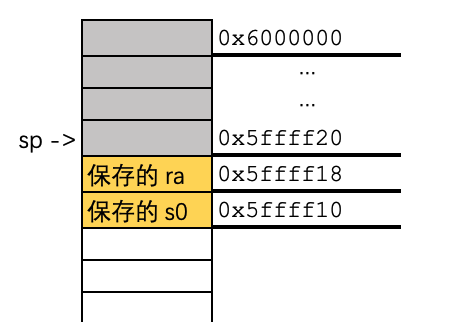

# CS107E Lecture 1/26

## ra 是哪个寄存器来着？

寄存器 x1，用来存储返回地址 return address

## jar 做什么的？

保存下一条指令地址到寄存器，然后跳转程序

## jarl 做了什么？

保存下一条指令地址到寄存器，然后根据寄存器跳转

## 怎么写函数？

1. `jal ra, pause` jal 保存内存顺序的下一条指令地址到ra，然后让指令跳转到延时程序上
    - 用于调用者加载函数
    - 使用默认的ra，可用 `jal pause` 简化
    - 使用的参数保存到 a0-a7，供函数使用
2. `jalr zero, ra, 0` jalr 不保存下一条指令，跳转回之前保存的指令上
    - 用于被调用者做函数返回
    - 不使用默认的ra，可用 `jr rs` 简化
    - 使用默认的ra，可用用 `ret` 简化
    - 返回值保存到 a0

## jal 相关的伪指令

- `j imm20` -> `jal zero, imm20`
- `jal imm20` -> `jal ra, imm20`

## jalr 相关的伪指令

- `jr rs` -> `jalr zero, rs, 0`
- `ret` -> `jalr zero, ra, 0`

## `call` 和 `tail`

- call 用来调用远处的子程序
  ```
  auipc x6, offset[31:12]
  jalr ra, x6, offset[11:0]
  ```
- tail 用来尾调用
  ```
  auipc x6, offset[31:12]
  jalr zero, x6, offset[11:0]
  ```
- 这两个的区别只在于 tail 不保存返回地址，从而用在函数结尾处

## caller 和 callee 是什么？

- 调用者，被调用者

## 栈使用的寄存器是什么？

- 寄存器 `x2`，abi名称 `sp`，`stack pointer`
- 栈指针指向最后推入的地址

## 如何操作栈？

0. 假设本函数名称为 `fn1`，调用本函数的函数是 `fn0`，本函数调用的函数是 `sum`
1. 原始状态
   
2. `addi sp, sp, -16`，准备做push操作
   
3. `sd ra, 8(sp)`，push ra，保存f0跳转前的下一条指令地址
   
4. `sd s0,0(sp)`，push s0，保存 f0 的 s0 值
   
5. `addi s0, sp, 16` 将入栈前的 sp 地址 保存到 s0 中
   
6. `mv a1, a0` 设置函数sum的参数
7. `call sum` 先把顺序下一条指令保存到ra，然后跳转到 sum 函数
8. `ld ra, 8(sp)`
9. `ld s0, 0(sp)` 将之前的 ra 和 s0 出栈，返回调用sum前的状态
10. `addi sp, sp, 16` 栈指针返回之前的位置，之前保存的ra和s0相当于删掉了
    
11. `ret` 根据现在的 ra 地址跳回 f0
