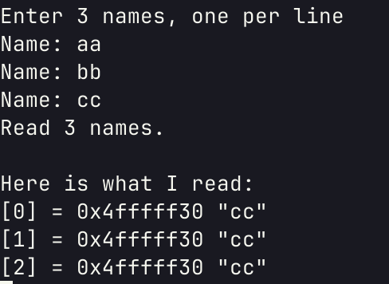

# CS107E Lecture 2/5 Memory Management

## **frame pointer** 是什么？

- 是栈相关的概念
- 栈指针 stack pointer 也就是 sp，指向栈顶
- 帧指针 frame pointer 也就是 fp，指向栈底

> 1. 什么是frame pointer
>
> frame pointer指向本函数栈帧顶，通过它可以找到本函数在进程栈中的位置。有专门的寄存器保存该值。
>
> 2. frame pointer有什么用
>
> 主要是backtrace用，每个函数的frame pointer保存在其后调用的函数的栈帧中。因此可以得到调用层级里面的每个函数的栈帧，从而可以打印出back trace。
>
> 3. 程序执行的过程中为什么可以不要frame pointer
>
> 在汇编层面的每个函数自己内部就完成了push和pop栈的操作，每个函数知道自己所使用的这段栈的栈结构，在开始执行的时候把变量和常用寄存器push进去，在执行完了后，pop出来。因此程序执行过程中是不需要frame pointer的。

来自 https://www.cnblogs.com/hustdc/p/7631370.html

## 从 `names.c` 里看到了什么？

- 定义了三个字符串用来存“名字”
- 定义了一个返回 `static char *` 的函数，返回输入的字符串存储的地址
- 打印以上内存地址的内容

## 运行程序结果如何？



## 为什么会这样？

重复分配了栈地址给存储

## 看看 `malloc.c`

```c
#define roundup(x,n) (((x)+((n)-1))&(~((n)-1)))
```

将x向上取整，成为n的倍数

```c
void *sbrk(size_t nbytes);
```

- 每次调用这个函数，都在内存中分配一个大小的内存，并返回这个内存地址
- 这个函数简单的把一直增加地址，不使用之前已释放的内存

## `size_t` 是什么？

- 由头文件 `stddef.h` 提供
- 整形
- 32 位机器一般是`unsigned int`，占 4 字节
- 64 位机器一般是`unsigned long`，占 8 字节