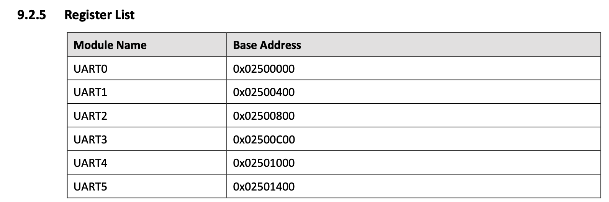
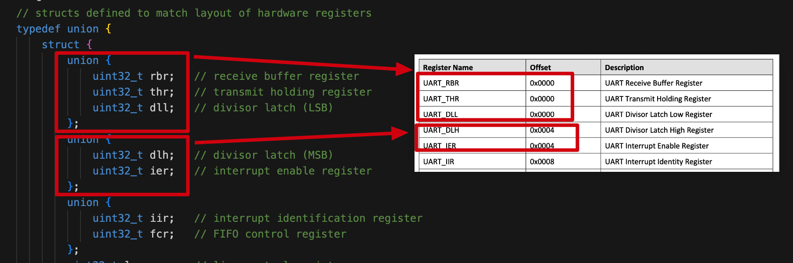

# _Static_assert
_Static_assert()接受两个参数，如果第一个参数是`false`，则编译器显示第二个参数，并且编译失败。

# 例子
```c
// structs defined to match layout of hardware registers
typedef union {
    struct {
        union {
            uint32_t rbr;   // receive buffer register
            uint32_t thr;   // transmit holding register
            uint32_t dll;   // divisor latch (LSB)
        };
        union {
            uint32_t dlh;   // divisor latch (MSB)
            uint32_t ier;   // interrupt enable register
        };
        union {
            uint32_t iir;   // interrupt identification register
            uint32_t fcr;   // FIFO control register
        };
        uint32_t lcr;       // line control register
        uint32_t mcr;       // modem control register
        uint32_t lsr;       // line status register
        uint32_t reserved[25];
        uint32_t usr;       // busy status, at offset 0x7c
        uint32_t reserved2[9];
        uint32_t halt;      // at offset 0xa4
    } regs;
    unsigned char padding[0x400];
} uart_t;

#define UART_BASE ((uart_t *)0x02500000)
_Static_assert(&(UART_BASE[0].regs.lcr) == (uint32_t *)0x0250000C, "UART0 lcr reg must be at address 0x0250000C");
_Static_assert(&(UART_BASE[1].regs.dlh) == (uint32_t *)0x02500404, "UART1 dlh reg must be at address 0x02500404");
```

## 为什么是`0x02500000`？
就是硬件地址，37MB地址的位置，d1-h_user_manual如下



## 为什么硬件地址是共用体`union`类型？
`union` 实现了让同一个地址当作不同的类型使用，所以uart_t 既可以看做是结构体 `regs` ，来控制串口寄存器，也可以看做`0x400 == 1KB`的占位，这样可以可以简单用uart_t[6]数组代表6个UART，



## _Static_assert 在这里的作用

- `#define UART_BASE ((uart_t *)0x02500000)`: `UART_BASE` 是一个指针，存储 `0x02500000`，类型是 `uart_t`
- `UART_BASE[0]`: `0x02500000` 这个地址存储的值，union 类型，主要使用的是结构体`reg`代表的寄存器
- `UART_BASE[0].regs`: 使用struct类型的变量，通过改变`UART_BASE[0].regs`的值可以控制串口寄存器，或读取串口寄存器内容
- `&(UART_BASE[0].regs.lcr)`: 读取`lcr`这个偏移量的地址
- `&(UART_BASE[0].regs.lcr) == (uint32_t *)0x0250000C`: 判断 UART0的寄存器UART_LCR的地址是否是`0x0250000C`
- `_Static_assert`: 硬件地址分配没有错，这此就能编译下去

## 没有意义
现在的知识无法理解为什么加_Static_assert的判断。因为以上代码的写法不会出现编译错误的情况。